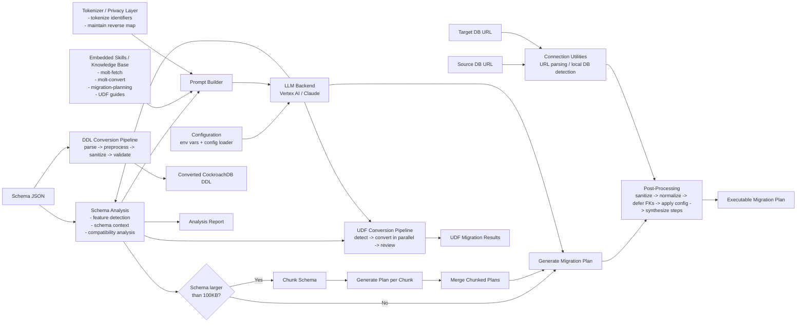
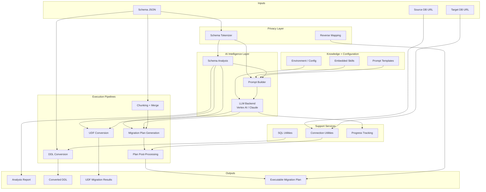
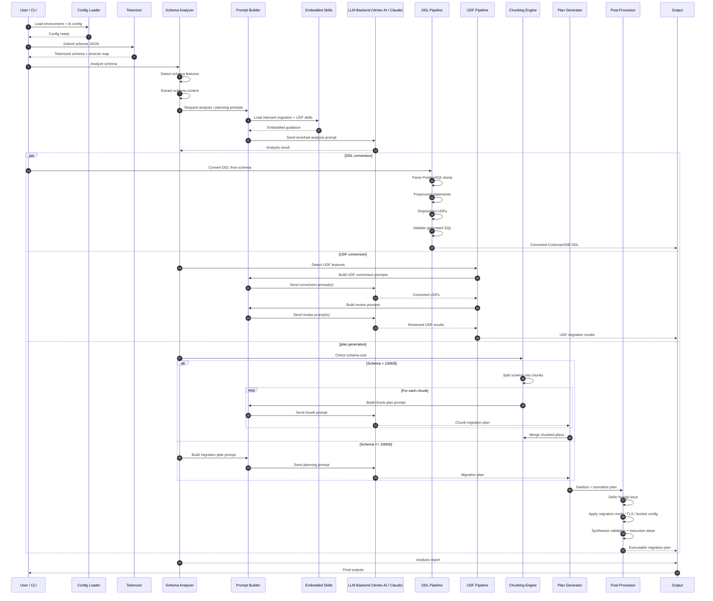

# MOLT AI Assistant — Architecture

This page documents the MOLT AI Assistant architecture with multiple diagram styles suitable for repository docs, review discussions, and presentations.

## Overview

The MOLT AI Assistant ingests schema metadata and database connection context, analyzes compatibility and migration complexity, applies embedded migration knowledge, invokes an LLM backend for planning and UDF conversion, and produces executable migration artifacts.

## High-Level Block Diagram

## Presentation-Style Architecture View

## Runtime Sequence Diagram

## Notes

- The tokenizer protects sensitive schema identifiers before prompt submission.
- Embedded markdown skills and templates shape the prompts sent to the LLM backend.
- Large schemas are chunked to stay within prompt and processing constraints.
- Post-processing converts model output into a safer, executable migration plan.
